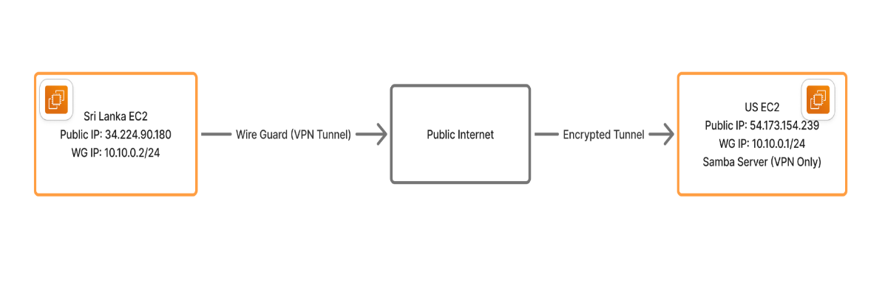

# VPN + Samba over WireGuard — Sri Lanka ↔ US

  <h2>Project Summary</h2>
  

    This lab demonstrates a private VPN between two Linux VMs using <strong>WireGuard</strong> and a Samba file share available only via the VPN.  
    - <strong>US</strong> (server): WireGuard server + Samba (WG IP: <code>10.10.0.1/24</code>)  
    - <strong>Sri_Lanka</strong> (client): WireGuard client (WG IP: <code>10.10.0.2/24</code>)
  

  <h3>What this repo contains</h3>
  <ul>
    <li><a href="report.pdf">report.pdf</a> — Full step-by-step guide, commands, configs, diagrams, and screenshots. (Open this first.)</li>
    <li><code>diagram.png</code> — Architecture diagram (add or replace with your exported diagram).</li>
    <li><code>wg0-server.conf</code>, <code>wg0-client.conf</code> — Example configs (remove private keys before publishing).</li>
    <li><code>smb.conf-snippet.txt</code> — Samba config snippet used for the lab.</li>
  </ul>

  

  <h2>Quick Architecture Diagram</h2>
  
Place your exported diagram image file named <code>diagram.png</code> at the repo root and it will render below:

  

  

  <h2>Short Testing Checklist</h2>
  
Use this quick checklist during your demo. For full commands, open <a href="report.pdf">report.pdf</a>.

  <ol>
    <li>Confirm WireGuard interface is up on both VMs and handshake exists.</li>
    <li>From Sri_Lanka: <code>ping 10.10.0.1</code> — expect replies.</li>
    <li>List Samba shares on US via VPN and mount the share from Sri_Lanka.</li>
    <li>Verify UFW/firewall blocks Samba on the public interface and allows it from <code>10.10.0.0/24</code>.</li>
    <li>Show that accessing Samba via the server public IP fails (proves VPN-only access).</li>
  </ol>

  

  <h2>Troubleshooting (Short)</h2>
  <ul>
    <li>If no WireGuard handshake: confirm public IPs, security group rules (UDP 51820), and peer keys.</li>
    <li>If Samba mount fails: check that the Samba share is bound to the WG interface and UFW rules allow only the VPN subnet.</li>
    <li>Full diagnostics & logs are documented in <a href="report.pdf">report.pdf</a>.</li>
  </ul>

  

  <h2>How to Use This Repo</h2>
  <ol>
    <li>Open <a href="report.pdf">report.pdf</a> and follow the step-by-step instructions in the lab.</li>
    <li>Use the example config files in the repo (remove any private keys before committing).</li>
    <li>Replace <code>diagram.png</code> with the exported diagram from the project editor for a polished README.</li>
  </ol>

  

  <footer class="small">
    
Created for a System Administration assignment — WireGuard & Samba lab (Sri Lanka ↔ US).

    
License: MIT (see LICENSE file if included).

  </footer>

</body>
</html>
